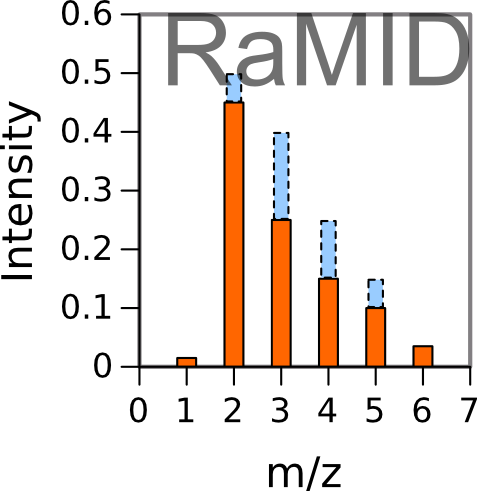
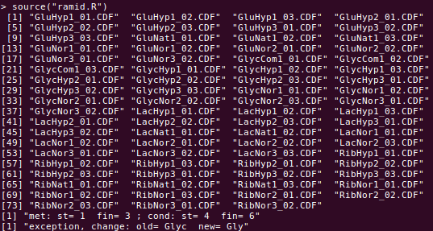
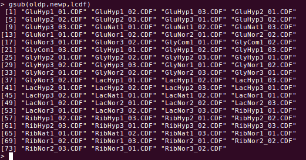
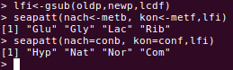

# RaMID
Version: 1.0

## Short description
R-program to read CDF files, created by mass spectrometry machine, and evaluate the mass spectra of 13C-labeled metabolites 

## Description

RaMID is a computer program designed to read the machine-generated files saved in netCDF format containing registered time course of m/z chromatograms. It evaluates the peaks of mass isotopomer distribution (MID) making them ready for further correction for natural isotope occurrence.
RaMID is written in “R”, uses library “ncdf4” (it should be installed before the first use of RaMID)  and contains several functions, located in the files “ramid.R” and "libcdf.R", designed to read cdf-files, and analyze and visualize  the spectra that they contain.

## Key features

- primary processing of 13C mass isotopomer data obtained with GCMS

## Functionality

- Preprocessing of raw data
- initiation of workflows

## Approaches

- Isotopic Labeling Analysis / 13C
    
## Instrument Data Types

- MS

## Data Analysis

RaMID reads the CDF files presented in the working directory, and then
- separates the time courses for selected m/z peaks corresponding to specific mass isotopomers;
- corrects baseline for each selected mz;
- choses the time points where the distribution of peaks is less contaminated by other compounds and thus is the most representative of the real analyzed distribution of mass isotopomers;
- evaluates this distribution, and saves it in files readable by MIDcor, a program, which performs the next step of analysis, i.e. correction of the RaMID spectra for natural isotope occurrence, which is necessary to perform a fluxomic analysis.
- correction for H+ loss produced by electron impact, natural occurring isotopes, and peaks overlapping

## Screenshots

- screenshot of input data (format Metabolights), output is the same format with one more column added: corrected mass spectrum

## Tool Authors

- Vitaly Selivanov (Universitat de Barcelona)

## Container Contributors

- [Pablo Moreno](EBI)

## Website

- N/A

## Git Repository

- https://github.com/seliv55/RaMID

## Installation

- 1) As independent program. RaMID itself does not require installation. Standing in the RaMID directory enter in R environment with the command:
  
'''  R '''
  
 read the necessary functions:
  
''' source("ramid.R")'''

The file “ramid.R” contains commands to include ncdf4 library, necessary to read CDF files (it is free software that should be installed before starting an analysis), and file "libcdf.R", containing all the needed functions.

- 2) Create a library of functions:
     # standing on the directory where the package is (RaMID) execute the following commands
     
'''    library(devtools)

       build()
       
       install() '''

  
## Usage Instructions

The previous command ('source("ramid.R")') in addition to loading all the necessary functions, already starts the analysis. 1) It sets the path to the previously created working directory. This directory should contain the CDF files designed for the analysis. The subdirectories "files" and "graf," are also necessary, although they can be empty. 2) It makes a list of names of CDF files contained in the working directory and prints this list, as the following screenshot shows.

This list is used further to deduce the metabolites and conditions designed for the analysis. Therefore, although there are no restrictions to the CDF filenames, they should contain some indications of a corresponding metabolite and condition. Here the characters in positions 1-3 indicated metabolites and 4-6 indicated conditions in most of the files. An exception is Glyc (stated for glycogen). This exception can be easily corrected by substitution "Glyc" by "Gly" in the list of filenames. This information is printed in the last two rows of the above screenshot. It is necessary to change these parameters to use a different system of names.

The analysis of an arbitrary set of CDF files created by mass spectrometry machine requires the following. Either create another directory with new CDF files (and, respectively, substitute the command 'setwd("./wd")') or substitute the current CDF files in the same directory ("./wd"). The changes in the list of filenames to facilitate the deducing the names of metabolites and conditions is done using 'gsub( oldp, newp, filenames )'.

After such an adjustment to a new set of data, the analysis starts by executing a function primcor():

.png)

This function reads the CDF files contained in the directory "wd" and evaluates the distribution of peaks corresponding to the spectra of mass isotopomers for the metabolites, which names it prints as the screenshot shows. RaMID saves in the directory "files" these spectra, which is the main result of its running, and in the directory "graf" the graphs of time courses of peaks of M+0 isotopologs.

Some words about the particular implementation of automatically finding the metabolites and conditions. If some correction of filenames is required to get a unified system of filenames that facilitates the search of metabolites and conditions, then use gsub(...) (in this example it is already included in 'primcor()'): 

Now the list lcdf does not contain exceptions. Then use seapatt(...) to evaluate the set of metabolites and conditions from the list of corrected filenames:

This set of CDF files provides the data for the analysis of the four metabolites under the four conditions. The conditions are "Hyp"-hypoxia, "Nat"- no labeled substances registered in complete media of incubation, "Nor"- normoxia, "Com"- commercial preparations registered in minimal media.

